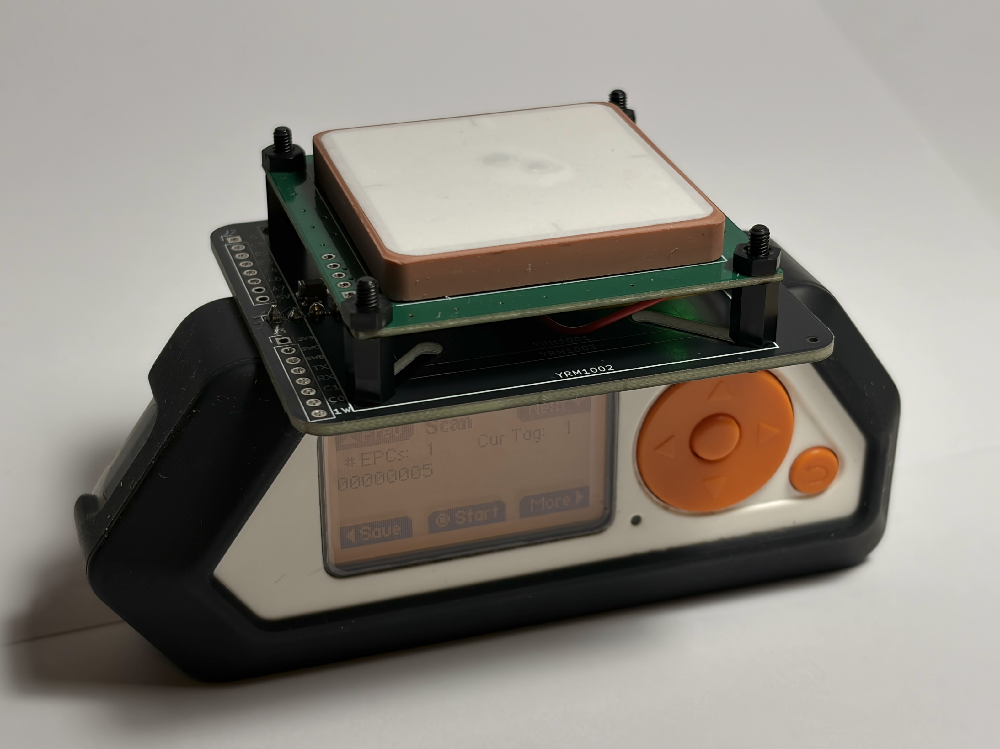
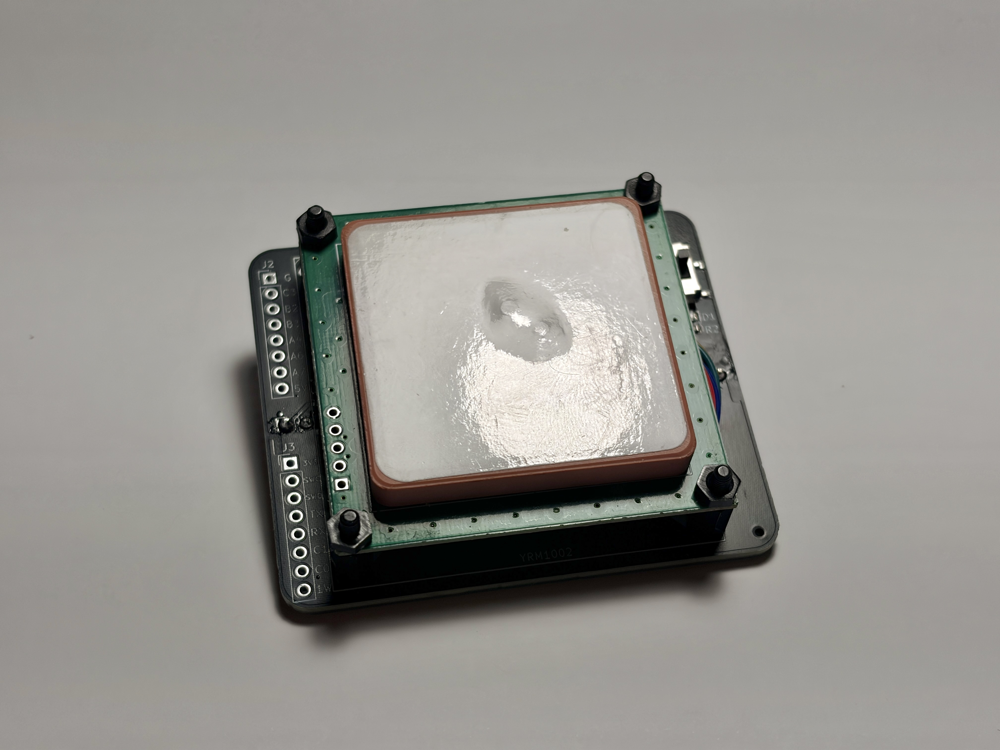
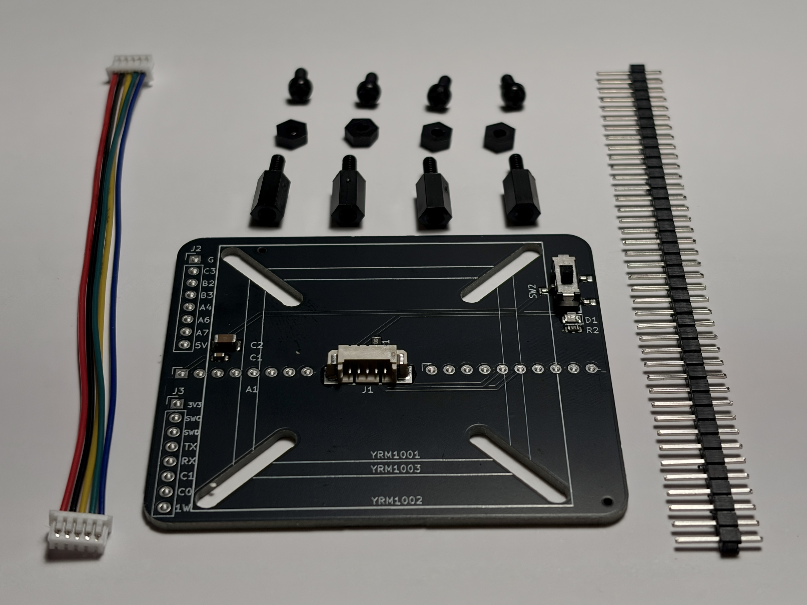
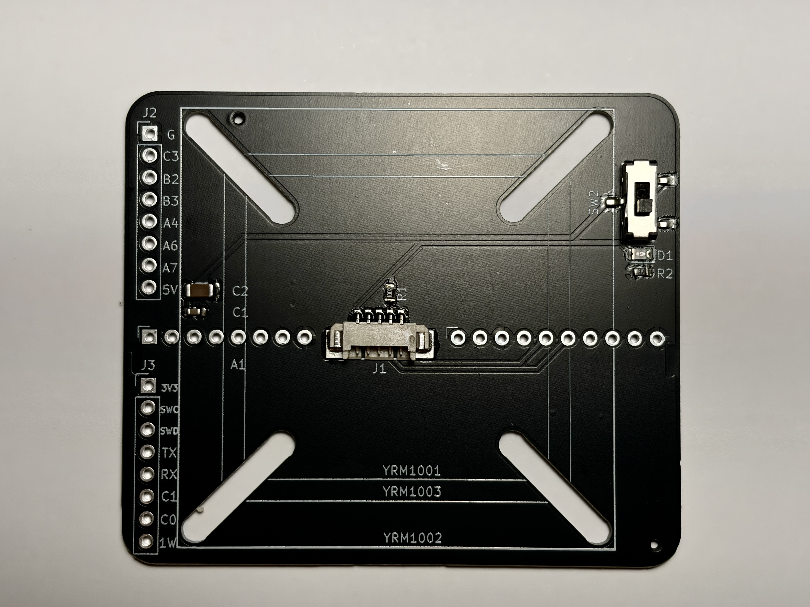
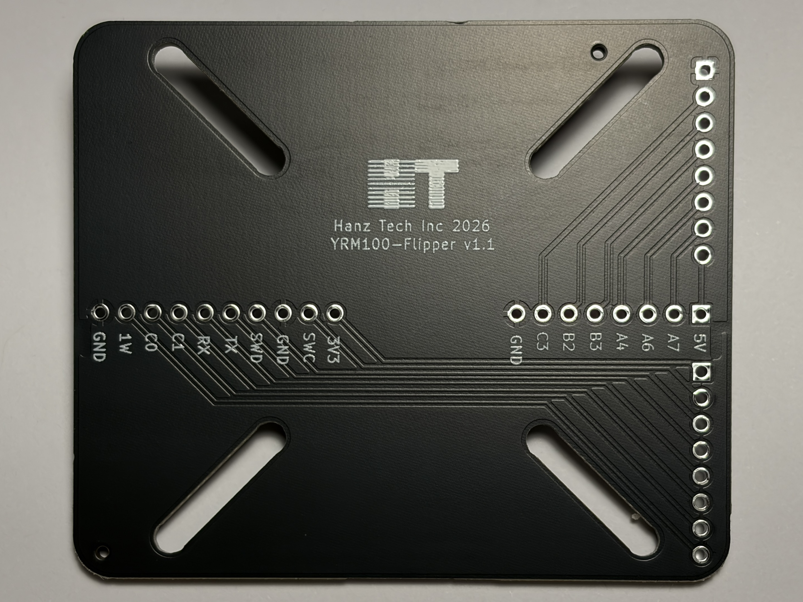

# YRM100 UHF RFID Flipper Zero Hat

A hat-style adapter PCB that plugs directly into the **Flipper Zero** and connects to the **YRM100/1/2/3 UHF RFID module**, enabling long-range RFID reading/writing out of the box.
Works with YRM1001/YRM1002/YRM1003 boards.

Available for purchase from [Tindie](https://www.tindie.com/products/hanztech/flipper-zero-uhf-rfid-yrm100x-adapter/) or [Etsy](https://www.etsy.com/ca/listing/4545558711/flipper-zero-uhf-rfid-yrm100x-adapter)

## Overview

This adapter board bridges the Flipper Zero's GPIO headers to the YRM100 UHF RFID module via a plug-and-play form factor. It provides:

- **5V power** and **3.3V logic** from the Flipper Zero
- **Crossed UART** (TX ↔ RX) for serial communication with the YRM100

- **Power switch** 

## Images

## Connectors

### Flipper Zero (2× 1×8 headers, 2.54 mm pitch)

| Pin | Signal | Pin | Signal |
|-----|--------|-----|--------|
| 1 | **5V** | 9 | **3.3V** |
| 2 | PC0 (GPIO) | 10 | SWC |
| 3 | PC1 (GPIO) | 11 | GND |
| 4 | PC2 (GPIO) | 12 | SIO |
| 5 | PC3 (GPIO) | 13 | **TX** → YRM100 RX |
| 6 | PB3 (GPIO) | 14 | **RX** ← YRM100 TX |
| 7 | PB2 (GPIO) | 15 | C1 |
| 8 | **GND** | 16 | C0 |

> **Note:** UART is crossed — Flipper TX (Pin 13) connects to YRM100 RX, and Flipper RX (Pin 14) connects to YRM100 TX.

### YRM100 Module (5-pin JST 1.25 mm pitch)

| Pin | Signal |
|-----|--------|
| 1 | 5V |
| 2 | GND |
| 3 | TX |
| 4 | RX |
| 5 | EN (pulled up to 3.3V via 10 kΩ) |

## Files

| File | Description |
|------|-------------|
| `yrm100_adapter.kicad_sch` | Schematic (KiCad 9.0) |
| `yrm100_adapter.kicad_pcb` | PCB layout (KiCad 9.0) |
| `yrm100_adapter.kicad_pro` | Project settings and design rules |

## Building / Ordering

1. Open `yrm100_adapter.kicad_pcb` in KiCad 9.0+
2. Run **Design Rules Check** (DRC) — should report zero violations
3. Run **Electrical Rules Check** (ERC) on the schematic — should report zero errors
4. Export **Gerber files** and **drill files** for PCB fabrication
5. Generate **BOM** and **position file** for component assembly

> **Note:** Verify exact footprints and component values against the schematic before ordering. Use the KiCad BOM generator for a complete parts list.

## License

MIT License